## Projektdokumentation: Face Recognition Service

| Übersicht               | Inhalt                                          |
| :---------------------- | :---------------------------------------------- |
| **Modul**               | M346: Cloudlösungen konzipieren und realisieren |
| **Team**                | Paulo Capelos, Tom Nielsen, Sai Ragavan         |
| **Abgabedatum Projekt** | Dienstag, 23. Dezember 2025, 23:59 Uhr          |
| **Repository Link**     | https://github.com/tominus3/M346_Project_TPS    |
| **Lehrperson**          | Martin Früh (frm1971)                           |

## 1. Installation und Setup

### 1.1. Voraussetzungen

- Ein AWS-Konto mit den erforderlichen Berechtigungen zum Erstellen und Verwalten von S3-Buckets und Lambda-Funktionen.
- AWS CLI installiert und konfiguriert auf Ihrem lokalen Rechner.
- Git installiert auf Ihrem lokalen Rechner.
- Git-Bash (für Windows-Benutzer empfohlen).

### 1.2. Einrichtung des Services

Folgen sie den untenstehenden Schritten, um den Face Recognition Service einzurichten und auszuführen. Jegliche Befehle sind im Terminal (Git-Bash für Windows-Nutzer) auszuführen.

#### 1.2.1 Klonen Sie das Repository:

```bash
git clone https://github.com/tominus3/M346_Project_TPS.git
```

#### 1.2.2 AWS Credentials konfigurieren:

Navigieren Sie sich zu ihren AWS Academy Learners Lab und kopieren sie die Credentials, welche sie unter: Launch AWS Academy Learners Lab -> AWS Details finden, indem sie auf "Show AWS Credentials" klicken. Kopieren sie anschliessend den Inhalt.

##### 1.2.2.1 Linux Version

Den Inhalt geben sie in in ihrem Laufwerk unter `.aws/credentials` ein.

Falls sich der Ordner nicht im gegebenem Pfad befindet, können sie diesen erstellen indem sie den folgenden Befehl ausführen:

```bash
aws configure
```

#### 1.2.2.2 Windows Version

Den Inhalt geben sie in in ihrem Laufwerk unter `C:\Users\<Benutzername>\.aws\credentials` ein.

Falls sich der Ordner nicht im gegebenem Pfad befindet, können sie diesen erstellen indem sie den folgenden Befehl ausführen:

```bash
aws configure
```

#### 1.2.3 Service Initialisierung:

Als erstes muss der Service initialisiert werden. Vergewissern sie sich, dass sie sich im Verzeichnis "Scripts" befinden und führen sie anschliessend den folgenden Befehl aus:

```bash
./Init.sh
```

Darauf hin müssen sie einen Namen für ihr S3 In-Bucket und S3 Out-Bucket angeben.

#### 1.2.4 Bilddaten hochladen:

Laden sie das Bild, welches sie analysieren möchten, im Verzeichnis "Test" hoch. vergiwssen sie Sich, dass das Bild im JPG-Format vorliegt.

#### 1.2.5 Service Ausführung:

Führen sie anschliessend im gleichen Verzeichnis den folgenden Befehl aus, um den Service zu starten:

```bash
./test.sh <Bildname>.jpg
```

#### 1.2.6 Löschen der Ressourcen:

Um die erstellten Buckets zu löschen, führen sie im Verzeichnis "Scripts" den folgenden Befehl aus:

```bash
./Reset.sh
```

## 2. Service-Architektur und -Implementierung

In diesem Abschnitt wird die technische Umsetzung des Face Recognition Service erläutert. Der Service basiert auf einer eventgesteuerten Architektur (Serverless), die AWS S3 und AWS Lambda nutzt.

### 2.1 Infrastruktur-Management: S3-Buckets

Die Speicherung der Daten erfolgt in zwei getrennten S3-Buckets, um Eingangsdaten und Analyseergebnisse zu trennen.

- **Erstellung und Konfiguration (`CreateInputBucket.sh` & `CreateOutputBucket.sh`):** Diese Skripte legen die benötigten Buckets in der Region `us-east-1` an. Dabei werden die Public Access Blocks deaktiviert und die Object Ownership auf `BucketOwnerPreferred` gesetzt, um eine korrekte Berechtigungssteuerung via ACLs zu ermöglichen.

- **Bereinigung (`DeleteBuckets.sh`):** Dieses Skript ermöglicht das automatisierte Löschen der Projektressourcen. Es fordert den Benutzer zur Eingabe des Suffixes auf und entfernt beide Buckets inklusive aller enthaltenen Objekte (`--force`).

### 2.2 Logik und Automatisierung: AWS Lambda

Das Herzstück des Services ist die Lambda-Funktion, welche die Bildanalyse steuert.

- **Bereitstellung der Serverless-Funktion (`CreateLambdaFunction.sh`):** Das Skript automatisiert das Deployment der Funktion "FaceRecognitionLambda". Es verwendet die `dotnet8` Runtime und weist der Funktion die notwendige `LabRole` sowie die Handler-Konfiguration zu. Falls die Funktion bereits existiert, wird lediglich der Code über die `LambdaFunction.zip` aktualisiert.
- **Ereignissteuerung und Workflow-Integration (`CreateS3Trigger.sh`):** Um den Prozess zu automatisieren, wird ein S3-Trigger konfiguriert. Das Skript erteilt S3 die `InvokeFunction`-Berechtigung und setzt eine Event-Notification auf den Input-Bucket, die bei jedem `s3:ObjectCreated:*`-Ereignis die Lambda-Funktion auslöst.

- **Abhängigkeit der Namensgebung:** Der Name der Lambda-Funktion (FaceRecognitionLambda) ist in den Skripten CreateLambdaFunction.sh und CreateS3Trigger.sh jeweils hart codiert. Falls eine Namensänderung der Funktion gewünscht ist, muss diese zwingend in beiden Skripten gleichzeitig angepasst werden. Andernfalls kann der S3-Trigger die Berechtigungen nicht korrekt setzen oder die Funktion nicht finden.

### 2.3 Systemarchitektur

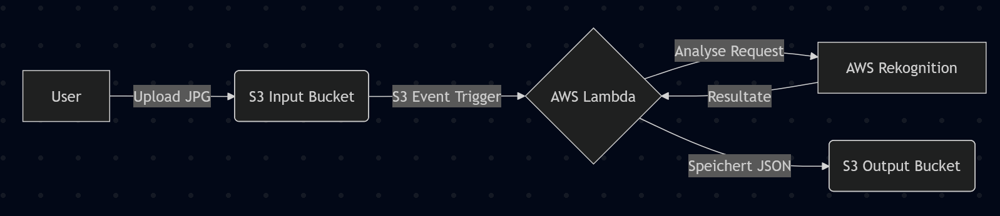
Das Architektur-Diagramm visualisiert den automatisierten Workflow des Services: Ein User lädt ein Bild in den S3 Input Bucket hoch, was durch einen S3 Event Trigger die AWS Lambda-Funktion aktiviert. Die Lambda-Funktion sendet einen Analyse Request an AWS Rekognition, empfängt die erkannten Resultate und speichert diese abschliessend als JSON-Datei im S3 Output Bucket ab.

## 3. Testen des Services

### 3.1 Windows 11 Testprotokoll

Zeitpunkt: 21.12.2025
Tester: Sai Ragavan
Betriebssystem: Windows 11

1. Credentials konfigurieren.
   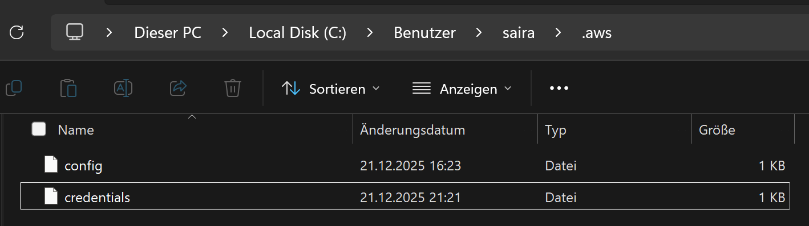

2. JPG-Bild hochladen. (Falls, noch nicht geschehen)
   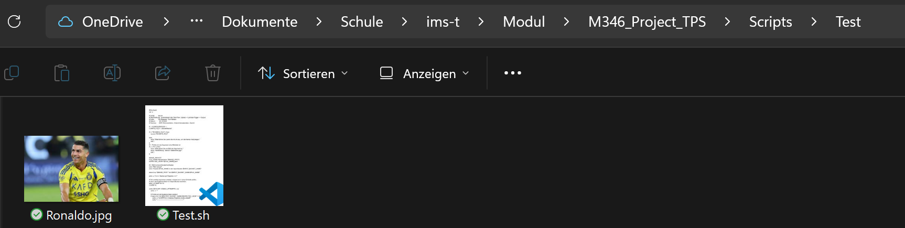

3. Initialisierung des Services.
   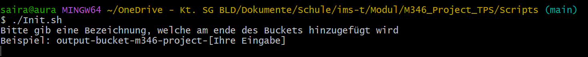

   Der Nutzer wird aufgefordert, einen Namen für die Buckets anzugeben.

4. Name des Buckets angeben.
   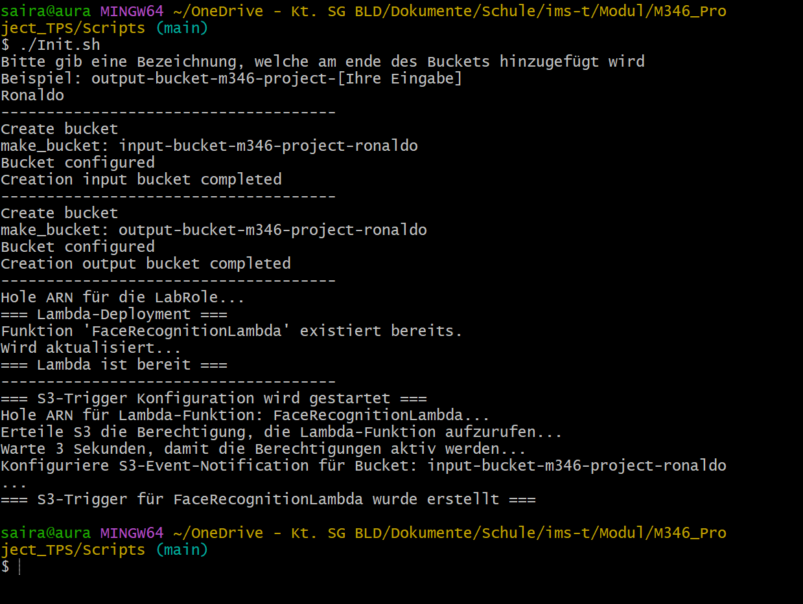

   Nachdem der Nutzer die Namen der Buckets angegeben hat, werden diese erstellt und die S3-Trigger sowie die Lambda-Funktion konfiguriert.

5. Service ausführen.
   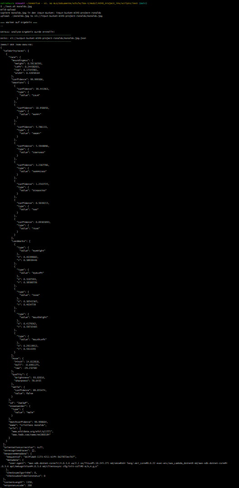
   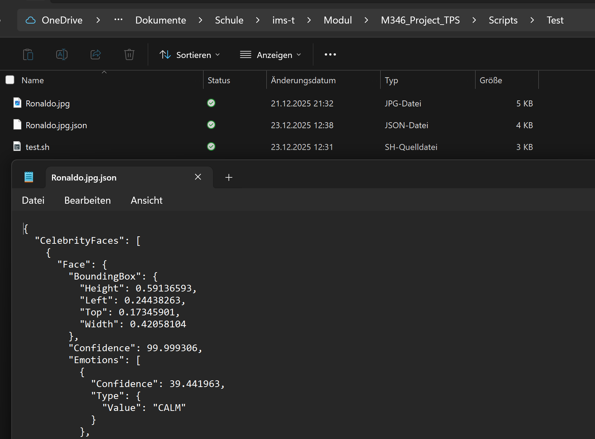

   Der Service wird ausgeführt und es sucht das Gesicht im Bild. Sobald die Berühmtheit erkannt wurde, wird das Ergebnis im Output-Bucket gespeichert und im Terminal ausgegeben. Ausserdem wird eine JSON-Datei erstellt, welche die Details der erkannten Berühmtheit enthält.

6. Löschen der Ressourcen.
   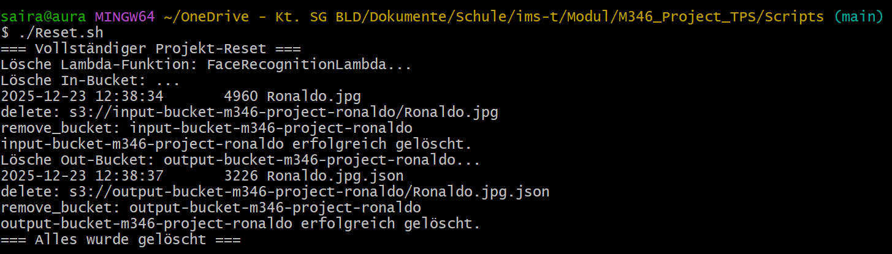
   Der Service wird zurückgesetzt und die erstellten Buckets werden gelöscht.

   **Fazit**: Der Service funktioniert einwandfrei und erkennt die Berühmtheit in den Bildern korrekt.

### Linux Testprotokoll

Zeitpunkt: 21.12.2025
Tester: Sai Ragavan
Betriebssystem: Ubuntu 22.04 LTS

1. Credentials konfigurieren.
   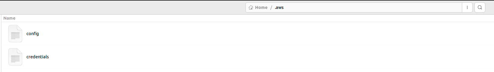

2. JPG-Bild hochladen. (Falls, noch nicht geschehen)
   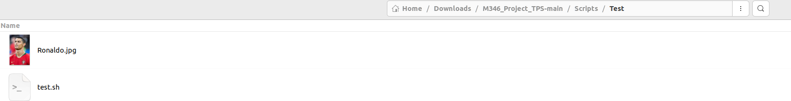

3. Initialisierung des Services.
   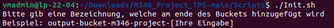

4. Name des Buckets angeben.
   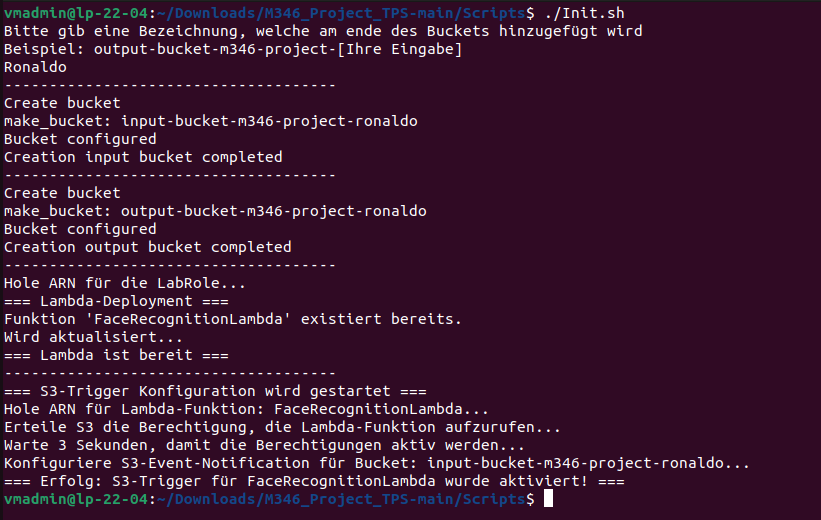

5. Service ausführen.
   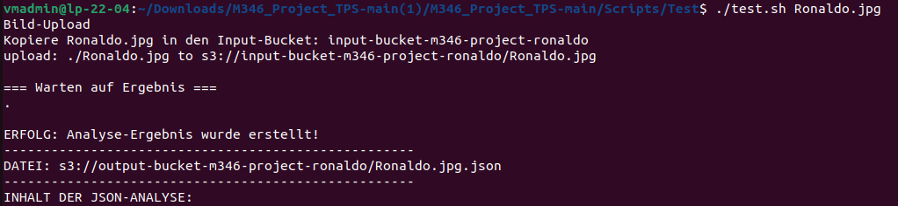
   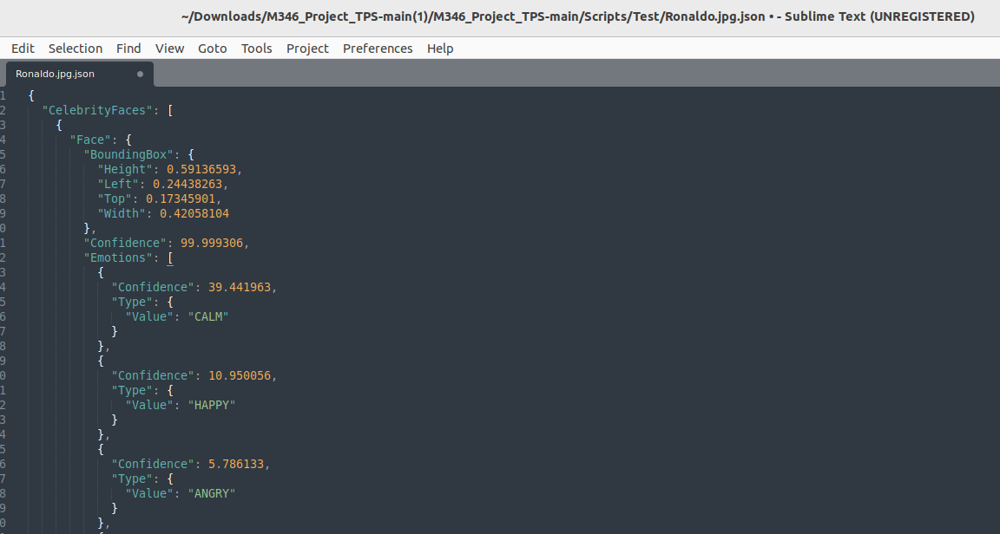

   Der Service wird ausgeführt und es sucht das Gesicht im Bild. Sobald die Berühmtheit erkannt wurde, wird das Ergebnis im Output-Bucket gespeichert und im Terminal ausgegeben. Ausserdem wird eine JSON-Datei erstellt, welche die Details der erkannten Berühmtheit enthält.

6. Löschen der Ressourcen.
   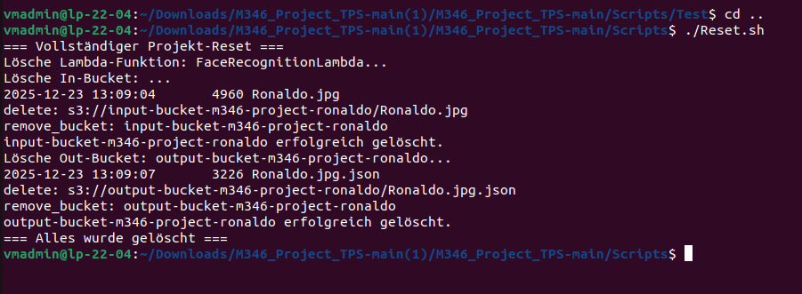

   Fazit: Der Service funktioniert einwandfrei und erkennt die Berühmtheit in den Bildern korrekt.

### 3.3 Empfehlungen

- Speichern sie das Bild im mit einem Kurzen Namen, damit sie dieses einfach im Terminal aufrufen können.
- Vergewissern sie sich, dass das Bild im JPG-Format vorliegt.
- Achten sie darauf, dass die AWS Credentials korrekt konfiguriert sind

## 4. Reflexion

### 4.1. Paulo Capelos

#### Positive Aspekte

Ich konnte endlich wieder meine Skripting-Kenntnisse auffrischen, da ich dies schon seit Längerem nicht mehr gemacht hatte. Zusätzlich habe ich noch einiges dazugelernt. Ein paar Punkte davon sind:

1. Automatisierung der Bucket-Erstellung: Ich habe gelernt, wie man die Erstellung von Buckets mithilfe der AWS CLI vollständig automatisiert. Der Benutzer muss nur ein geeignetes Suffix eingeben, und schon wird der Bucket erstellt und automatisch konfiguriert.

2. Sichere Konfiguration: Ich weiss nun, wie man einen Bucket mit den Mindestanforderungen so konfiguriert, dass der Besitzer die volle Kontrolle über die Objekte behält, selbst wenn diese von einem dritten Benutzer hochgeladen wurden.

3. User-Experience durch Init-Skript: Ich habe gelernt, wie man ein init.sh schreibt, das alles vorbereitet und installiert, was für eine deutlich bessere User-Experience sorgt.

Anhand dieses Projekts habe ich auch meine Kompetenz in der Teamarbeit gefördert. Wir haben sehr gut zusammengearbeitet, Kritik ohne unnötige Diskussionen angenommen und waren offen für Verbesserungsvorschläge. Somit war die Teamarbeit für mich ideal.

Die Skripte sind optimal aufgebaut und mit Kommentaren strukturiert. Ebenfalls wurden Funktionen genutzt, um die Skripte übersichtlicher und lesbarer zu gestalten.

#### Verbesserungen

Die Funktionen in meinen Skripten CreateInputBucket.sh und CreateOutputBucket.sh hätten ausgelagert werden können, da sie im Prinzip dasselbe tun. Dies ist jedoch ein optionaler Schritt zur Optimierung und war für die Grundfunktion nicht zwingend erforderlich.

In zukünftigen Projekten möchte ich noch mehr Wert auf die Code-Lesbarkeit legen, damit meine Skripte von Anfang an optimal strukturiert sind.

#### Fazit

Zusammenfassend kann ich sagen, dass ich sehr zufrieden mit unserem Projekt bin. Wir haben gut kooperiert und auch in den Ferien am Projekt weitergearbeitet. Die Aufgaben wurden sinnvoll aufgeteilt und jeder hat seinen Teil zuverlässig erledigt.

Ich persönlich habe viel mitgenommen, zum Beispiel, wie man die Erstellung konfigurierter Buckets automatisiert oder ein sorgfältiges init.sh erstellt.

### 4.2. Tom Nielsen

#### Positive Aspekte

In diesem Projekt habe ich gelernt, Cloud-Komponenten sinnvoll zu verbinden und zu automatisieren. Besonders wichtig war für mich die saubere Trennung von Konfiguration und Logik. Durch die zentrale Datei für die BucketNames konnte ich alle Skripte einheitlich steuern und Änderungen schnell umsetzen.

Die Skripte sind stabil aufgebaut und funktionieren auch in unterschiedlichen Umgebungen. Durch die automatische Erkennung der benötigten Rollen und das kontrollierte Testen habe ich verstanden, dass Lambda asynchron arbeitet und Resultate nicht sofort verfügbar sind.

Die Arbeit mit der AWS CLI hat meinen Workflow deutlich verbessert. Viele Schritte, die manuell aufwendig wären, konnte ich automatisieren. Dadurch wurde die Konfiguration schneller, reproduzierbar und weniger fehleranfällig.

#### Verbesserungen

In zukünftigen Projekten möchte ich Benutzereingaben früher prüfen, damit Fehler sofort erkannt werden. So kann verhindert werden, dass fehlerhafte Werte erst beim Erstellen von Cloud-Ressourcen auffallen.

Ausserdem will ich meine Skripte modularer aufbauen. Wiederkehrende Funktionen sollen ausgelagert werden, damit der Code übersichtlicher und leichter wartbar ist.

Ein weiterer Verbesserungspunkt ist der Testprozess. Durch mehrere automatische Tests mit unterschiedlichen Dateien könnte die Zuverlässigkeit der Lösung weiter erhöht werden.

#### Fazit

Das Projekt hat mir gezeigt, dass ich die Grundlagen von Cloud-Automatisierung gut verstehe. Besonders stolz bin ich auf die klare Struktur und den vollständig automatisierten Ablauf von der Erstellung bis zum Reset. Für meine weitere Entwicklung sehe ich den nächsten Schritt in professionelleren Automatisierungs- und Strukturierungsansätzen.

### 4.3. Sai Ragavan

#### Positive Aspekte

Während dieses Projekts habe ich wertvolle Erfahrungen im Umgang mit AWS-Diensten gesammelt, insbesondere mit S3 und Lambda. Die Automatisierung der Infrastruktur mittels Shell-Skripten hat mir gezeigt, wie effizient Cloud-Ressourcen verwaltet werden können. Besonders stolz bin ich darauf, dass ich die gesamte Service-Architektur erfolgreich implementieren und testen konnte.

#### Verbesserungen

Trotz der erfolgreichen Implementierung gab es einige Herausforderungen, insbesondere bei der Fehlerbehandlung in den Skripten. In zukünftigen Projekten möchte ich die automatischen Prüfungen verbessern, um sicherzustellen, dass Eingaben und Ressourcen korrekt validiert werden, bevor sie erstellt oder modifiziert werden.

#### Fazit

Insgesamt hat mir dieses Projekt geholfen, meine Fähigkeiten in der Cloud-Entwicklung zu vertiefen. Ich habe gelernt, wie wichtig eine klare Struktur und Automatisierung sind, um komplexe Systeme effizient zu verwalten. Für zukünftige Projekte plane ich, meine Kenntnisse in der Fehlerbehandlung und im Testing weiter auszubauen.

## 5. Quellen

- [AWS Dokumentation](https://docs.aws.amazon.com/de_de/AmazonS3/latest/userguide/GetStartedWithS3.html)
- [Gemini](https://gemini.google.com/app)
- [Unterrichtsmaterialien Online-Skript](https://gbssg.gitlab.io/m346/lab-aws/)
- Unterrichtsmaterialien OneNote
